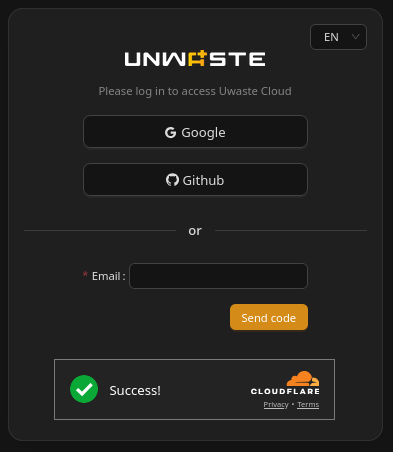
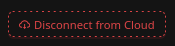

# Connecting / disconnecting

# Connecting the Unwaste Robot to Cloud

## Overview

This section explains how to connect and disconnect a **local Unwaste Robot** to an **existing Unwaste Cloud account**.

Connecting the Unwaste Robot to the cloud links a locally running system with the Unwaste Cloud, enabling cloud‑based visibility and remote access. The operation is fully reversible and does not change how the Unwaste Robot operates locally.

This document focuses only on the **connection and disconnection process** and their technical consequences. Information about cloud accounts, their benefits, or account creation is covered in other sections of the documentation.

---

## Prerequisites

Before connecting the Unwaste Robot to the cloud:

* The Unwaste Robot must have **internet access**.
* You must already have an **Unwaste Cloud account**.
* You must be able to log in to that account during the connection process.

Note: The Unwaste Robot is designed to operate locally even without a cloud connection. Cloud connectivity is required only for cloud‑based features and remote access.

---

## Where this action is performed

Connecting and disconnecting the Unwaste Robot from the cloud is always performed from the **local Unwaste Robot interface**.

This action cannot be initiated from the Unwaste Cloud interface.

---

## Connecting the Unwaste Robot to Cloud

To connect the Unwaste Robot to your Unwaste Cloud account:

1. Open the **local Unwaste Robot interface** in your browser.
2. Locate the cloud connection section.
3. Click **Connect to Cloud**.

 Device name

During the connection process, you will be asked to provide a **device name**.

* The name is used only for **display purposes** in the cloud interface.
* Multiple Unwaste Robots may use the same name; uniqueness is not enforced.
* For clarity, using unique and descriptive names is recommended.

Name constraints:

* Maximum length: **64 characters**
* The name **cannot start or end with whitespace**

The device name can be changed later in the cloud interface without affecting operation or history.

### Authentication

After providing the device name, you will be asked to log in to your **existing Unwaste Cloud account**.

You may choose any available authentication method (for example Google, GitHub, or email login). All methods are equivalent.

Important:

* Logging in **does not create a new cloud account**.
* Authentication is used only to associate this Unwaste Robot with your existing account.

 

### Successful connection

After successful authentication:

* The Unwaste Robot is linked to your cloud account.
* The interface is **automatically redirected to the Unwaste Cloud interface**.
* The robot appears in the cloud interface as **online**, typically with a short delay (up to about one minute).
* Cloud connectivity is established automatically.

The Unwaste Robot authenticates **once** during this process. The connection remains valid until it is explicitly disconnected by the user.

---

## What changes after connection

After connecting to the cloud:

* The **local interface remains fully available**.
* All local configuration and operation continue unchanged.
* The Unwaste Robot becomes accessible via the **Unwaste Cloud interface and mobile app**.

If the internet connection is temporarily lost:

* The Unwaste Robot continues operating locally.
* It automatically attempts to reconnect when connectivity returns.
* The robot is shown as **offline** in the cloud interface while disconnected.

---

# Disconnecting the Unwaste Robot from Cloud

To manually disconnect the Unwaste Robot from the cloud:

1. Open the **local Unwaste Robot interface**.
2. Locate the cloud connection section.
3. Click **Disconnect from Cloud**.
4. Confirm the action in the confirmation dialog.

 

After manual disconnection:

* The cloud connection is immediately revoked.
* The Unwaste Robot disappears from your cloud robot list.
* The robot remains fully operational locally.

Manual disconnection is a **persistent state**. The Unwaste Robot will not reconnect automatically. To restore cloud access, the user must explicitly connect again.

---

## Manual disconnect vs temporary connection loss

It is important to distinguish between these two situations:

### Manual disconnect

* Initiated explicitly by the user.
* Requires confirmation.
* Cloud association is removed.
* The robot disappears from the cloud interface.
* Reconnection requires user action.

### Temporary connection loss

* Caused by internet outage or network issues.
* The robot remains linked to the cloud account.
* The robot is shown as **offline** in the cloud interface.
* The Unwaste Robot automatically reconnects when internet access returns.

---

## Impact on tariffs and external data

### Static tariffs

If static tariffs are used:

* Tariff values configured in the system continue to be used.
* When the Unwaste Robot is connected to the cloud, static tariffs are periodically checked for updates (for example annual price updates).
* If the cloud connection is lost or manually disconnected, **no tariff updates are received**, and the Unwaste Robot continues operating with the **last known values**.

### Dynamic tariffs

Dynamic tariffs are obtained from the cloud in **daily batches**, typically between 22:00 and 23:00.

Behavior when cloud connection is lost:

* The Unwaste Robot continues operating normally **as long as valid price data is available**.
* This usually means until the end of the current day or the following day.
* Once price data is no longer available, the Unwaste Robot switches to **unmanaged mode**.

An alert is generated when this switch occurs.

Important: If you plan to disconnect the Unwaste Robot from the cloud for a longer period and use dynamic tariffs, it is strongly recommended to switch to a **CUSTOM tariff** beforehand.

---

## Alerts and visibility

Cloud‑related events generate alerts:

* Internet connection loss is shown as an alert **in the local interface**.
* When cloud connectivity is restored, the robot status is updated in the cloud interface.
* Alerts generated locally are synchronized to the cloud after reconnection, unless they were already cleared locally.

---

## Notes / Important

* Cloud connectivity is required for **remote access and mobile app control**.
* Loss of cloud connection does not stop local operation.
* Dynamic tariffs depend entirely on cloud connectivity.