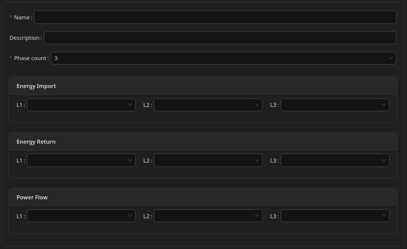

# Circuit

# What Is a Circuit

A **circuit** is a basic building block of your electrical installation.

If you imagine your electrical system as a tree:

* the **connection to the power grid** is the trunk,
* the system then splits into branches,
* and wall sockets or individual devices are the leaves.

A circuit represents one point in this tree where energy flows into or out of a part of the installation.

There is one special circuit called the **main circuit**.\nIt represents the trunk of the tree and connects all other circuits.

Each circuit can measure the energy flowing through its part of the system.\nThis is done by linking the circuit to one or more compatible smart meters.

---

## Main Circuit (Required)

The **main circuit is mandatory**.

Conceptually, the main circuit represents the **main electricity meter of your home or building** — the meter used by the energy provider to measure total energy imported from and exported to the grid.

It measures the total amount of energy flowing **into and out of your entire installation** and should be connected to the main smart meter of your grid connection.

Without correct readings from the main circuit, the Unwaste Robot cannot operate properly.

---

## Sub-Circuits (Optional)

All other circuits are optional.

They are not required for basic operation, but they are very useful if you want more detailed insight into how energy is used in specific parts of your installation.

Common examples include:

* Measuring energy usage of a home office or garage workshop
* Tracking energy consumption for individual rental rooms
* Seeing how much energy is used by a specific area, such as a kitchen and its appliances

---

# Configuration

---

## Phase Count

Defines whether the circuit uses:

* **1 phase**, or
* **3 phases**

---

## Energy Import

Defines which Home Assistant sensor(s) are used to measure energy flowing **into** the circuit.

For three-phase circuits, you can provide:

* one sensor for summed import (leaving the rest empty) - it must be specified in the L1 field
* three sensors, each corresponding to one phase - L1, L2, L3.

Only sensors that report **total energy values** are supported. This field is:

* **Required for the main circuit**
* **Optional for sub-circuits**

If any sub-circuit has no import reading, it will still show the summed energy usage of its own sub-circuits, but it will not display usage measured directly at that level.

Only energy sensors would be available on this list.

---

## Energy Return

Defines which Home Assistant sensor(s) are used to measure energy flowing **out of** the circuit, for example when exporting solar energy back to the grid.

Only sensors that report **total energy values** are supported.

As in the Energy Import, for three-phase circuits, you can provide:

* one sensor for summed return (leaving the rest empty)  - it must be specified in the L1 field
* three sensors, each corresponding to one phase - L1, L2, L3.

This setting is optional. By not providing this sensor, you are stating that the system should assume no energy is flowing back to the grid - which is correct when there is no Production element in this circuit or any of its sub-circuits.

Only energy sensors would be available on this list.

---

## Power Flow

Defines which Home Assistant sensor(s) are used to measure **instantaneous power** flowing through the circuit.

Only sensors that report **power values** are supported.

For three-phase circuits, you can provide:

* one sensor for summed power flow (leaving the rest empty)  - it must be specified in the L1 field
* three sensors, each corresponding to power flow on one phase - L1, L2, L3.

This setting is optional. If you don't provide this sensor, it would only mean that it will not be shown on power flow graphs.

Only power sensors would be available on this list.

---

# Important Notes

---

## Note 1

In installations without a dedicated smart meter (or without access to its data), a solar inverter may provide total energy import and return readings.

In some cases, these inverter readings can be used as a replacement for main circuit measurements.

Please consult a qualified electrician to confirm whether this applies to your installation.

---

## Note 2

Even for a three-phase circuit, it is allowed to configure **only one sensor** for energy import, energy return, or power flow.

This is common in installations where a single device (such as an inverter) provides only total values instead of separate readings per phase.

The system accepts either:

* one total reading, or
* three separate phase readings

and automatically combines them internally.

---

## Note 3

L1, L2 and L3 are designations for three different phases. They do not have to match the phase numbering used by the power utility. But if you opt to supply all three readings, these SHOULD be consistently designated - that is for example, if you designate a L2 phase reading in main circuit then you must consistently mark the same phase as L2 in all subcircuits and devices.

---

## Note 4

Do not mix a single total sensor with per-phase sensors within the same section.

For example, if you provide one summed energy sensor, it must be assigned to **L1**, and **L2** and **L3** must remain empty. Assigning a total sensor to L1 while also assigning per-phase sensors to L2 or L3 will result in values being counted multiple times, leading to incorrect and inflated energy or power readings.

If possible, avoid mixing total and per-phase sensors across the entire installation. The most reliable configurations are either:

* using only total readings (effectively treating the installation as single-phase), or
* using per-phase readings consistently for all circuits and devices.

In some installations this may not be fully possible, for example when a three-phase inverter provides only total energy values. In such cases, use total readings consistently and do not combine them with per-phase sensors.

# Screenshot

 

\