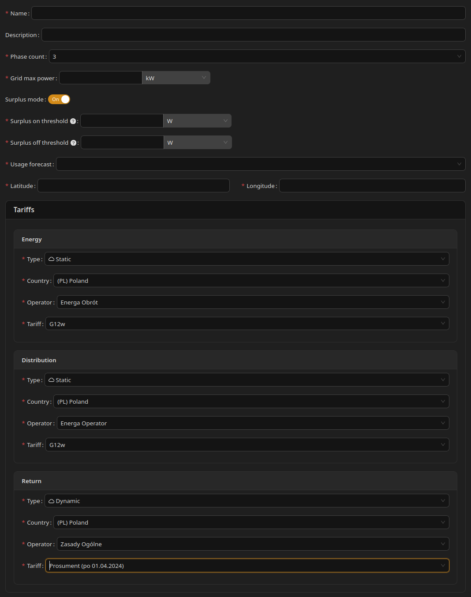

# Connection

# What Is a Connection

A connection represents a single physical connection to the power grid.

Most homes and businesses have only one such connection.

---

# Configuration

This section defines the technical and pricing parameters of your grid connection.

---

## Name and Description

**Name** is required. **Description** is optional.

---

## Grid Maximum Power

The **Grid Maximum Power** defines the highest electrical power that can be drawn from, or fed into, the power grid through this connection.

This value should be set to the **lower of the following two limits**:

* **Contractual limit** — The maximum power agreed in your contract with the energy provider. This limit is defined by the grid operator and exceeding it may result in penalties or disconnection.
* **Physical (installation) limit** — The maximum power allowed by the electrical protections installed in your building, such as main circuit breakers or fuses. These protections physically limit how much power can safely flow through the installation.

In practice, the usable maximum power of the connection is always constrained by the **stricter (lower) of these two values**, even if the other limit is higher.

**Important:** If you are unsure which value applies, consult your installation documentation or an electrician. Setting this value higher than the actual contractual or physical limit does not increase the available power. In real installations, exceeding these limits **may lead to tripping protective devices, damage to the electrical installation, or penalties imposed by the energy provider**.

---

## Phase Count

Specifies whether the connection uses:

* **1 phase**, or
* **3 phases**

---

## Surplus Mode

**Surplus mode** lets the Unwaste Robot react to local photovoltaic surplus (energy exported to the grid) by requesting **Surplus** operating mode on managed devices. Surplus sits between Comfort and Boost in terms of energy use — devices consume more when there is excess solar production.

### Enabling Surplus mode

Turn **Surplus mode** on in the connection configuration.

When enabled, you must also set:

* **Surplus on threshold** — average export power (W) over the previous 15 minutes above which the system considers surplus conditions active
* **Surplus off threshold** — average import power (W) in the current 15 minutes above which surplus conditions end

### Requirements

Surplus mode requires:

* **Energy import** and **Energy return** readings configured on the **main circuit**
* **Surplus** defined in the **States Map** for every managed device with State control enabled

Without these, the connection configuration cannot be validated while Surplus mode is on.

### Behaviour

* Surplus is applied automatically based on **grid import and export measurements** on the main circuit and the thresholds you configure. It does **not** depend on electricity prices.
* Price-based control runs **in parallel**. When both surplus conditions and a **Boost** price period apply, **Boost** is used instead of Surplus.
* Surplus is **not** available in schedules or overrides.
* When Surplus mode is active on a device, the dashboard may show **Surplus** as the mode source (see [Determining what controls a device](../Profiles,%20schedules%20and%20overrides/Determining%20what%20controls%20a%20device.md)).

For how the system decides when to enter and leave Surplus mode, see [Surplus mode](../Inner%20Workings/Surplus%20mode.md).

Surplus mode is optional. Use it when you have on-site PV generation and controllable loads that can use excess production.

---

## Location (Latitude and Longitude)

The geographical location of the connection, provided as latitude and longitude in decimal format.

It is used as a base location for weather and solar forecasts.

---

## Energy Usage Forecast Method

This forecast is **required** if the system manages an energy storage (for example, a battery). Otherwise, it is optional (you can set it to None).

The forecast estimates future energy consumption based on past usage.

Available methods:

* **None** – no consumption forecast is used
* **Daily** – averages energy usage from the last 14 days
* **Weekly** – averages energy usage for the same weekday over the last 4 weeks

---

## Tariffs

Tariffs define how much electricity costs.

This is one of the most important inputs for the Unwaste Robot, as it directly affects optimization decisions.

Tariffs are configured per connection, because each connection may have different prices.

---

## Price Components

Each connection can define up to three price components, which are configured independently.

* Each component has its own type selector.
* Each price component can use a tariff from a different country. For example, energy prices may come from a foreign provider, while distribution prices come from a local operator.

---

### Energy Prices

**Required.**

Defines the cost of electricity when it is purchased from the grid and how this cost changes over time.

In some regions, energy tariffs already include distribution costs. In such cases, the Distribution price component should be set to 'None'.

---

### Distribution Prices

**Optional.**

Defines the cost of electricity distribution, if charged separately, and how it varies over time.

Most commonly used together with dynamic energy prices.

Selecting "None" means that this price is included in energy price.

---

### Return Prices

**Optional**.

Defines the price paid for electricity exported back to the grid.

This price is usually different from the price paid when buying electricity.

This typically applies to installations with on-site generation, such as solar panels.

Selecting "None" means this component is ignored by the Unwaste Robot.

---

## Tariff Types

There are three supported tariff types for each price component:

---

### Dynamic Tariffs

Prices are based on energy market indexes.

Prices change frequently—typically every hour, and sometimes every 15 minutes.

Because of this, the Unwaste Robot updates prices daily by downloading them from the cloud (you cannot define prices yourself).

To configure a dynamic tariff, simply select it from the list: **country → energy provider → tariff name**

Selecting a country updates available providers list to show those from this country, and selecting provider updates list of available tariffs.

**Note:** This type of tariffs requires the Unwaste Robot to be connected to cloud to download prices for the upcoming day.

**Important: when dynamic prices are unavailable**

* Dynamic prices are downloaded daily. If the Unwaste Robot cannot download new prices (for example due to connectivity issues), it generates an **alert** for the user.
* The Unwaste Robot **does not reuse yesterday's prices** as a fallback. Daily dynamic prices may differ significantly, and using outdated prices could lead to incorrect decisions and financial loss.
* When valid dynamic prices are not available, the system switches affected devices to **Unmanaged mode** until current prices are available again.
  * In Unmanaged mode, the Unwaste Robot does not send Eco / Comfort / Boost / Off control signals based on dynamic pricing.
  * Monitoring and views may still work if measurements are available.

---

### Static Tariffs

Prices are mostly fixed and usually vary only by time of day. They may also include weekend or seasonal variations.

They are maintained externally and updated automatically.

Configuration is done by selecting the tariff from the list: **country → energy provider → tariff name**

Selecting a country updates available providers list to show those from this country, and selecting provider updates list of available tariffs.

**Important!** This type of tariffs requires the Unwaste Robot to be connected to cloud to check for tariff updates.

---

### Custom Tariffs

Custom tariffs work like static tariffs but are defined manually instead of being selected from a list.

You must provide:

* **Season** – months when the rule applies
* **Weekdays** – days of the week when the rule applies
* **Default price** – base price for the day
* **Exceptions** – time ranges with different prices

**Custom tariffs are the only tariff type that can be used without connecting the** Unwaste Robot **to the cloud.**

---

## Example tariff configuration

The most common configuration of tariffs would consist of:

* a static energy price
* no distribution price (as it is usually included in energy price in such scenario)
* a static return price (needed when you have solar panels)

---

## Important note

Incorrect tariff configuration may lead to suboptimal or misleading optimization results.

---

# Screenshot

 

