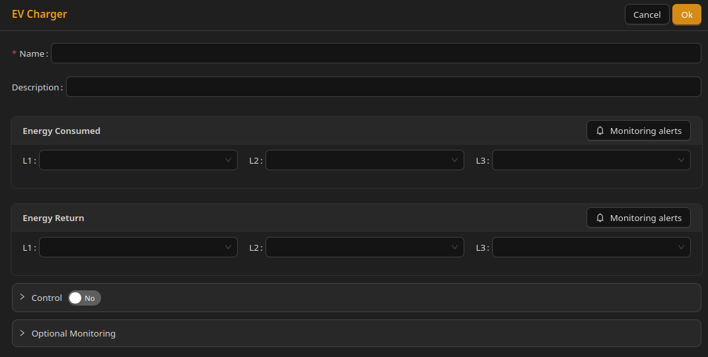

# EV Chargers

## Configuration

EV chargers are relatively easy to configure.

---

### Energy consumed

Optional. Select one to three Home Assistant entities representing total energy consumption.

For a three-phase device, you can provide:

* one sensor for summed energy (leaving the rest empty) - it must be specified in the L1 field
* three sensors, each corresponding to one phase - L1, L2, L3.

For a single-phase device in a three-phase installation, only one field is used. It should correspond to the phase of the circuit the device is connected to.

---

### Energy return

Optional. Select one to three Home Assistant entities representing energy exported from the charger (if applicable).

---

### Power flow

Optional. Instantaneous power is configured in **Optional monitoring**. See [Optional monitoring](../Optional%20monitoring.md).

---

### Control

Control configuration is identical to other devices. See [Device control](Device%20control.md).

Important:

The Unwaste Robot does not guarantee vehicle charge completion by a specific time, especially that it has no control over things such as:

* Control signals mean nothing if vehicle is not connected to charger.
* Vehicle-side limits or charger firmware may override control signals. **The Unwaste Robot cannot start charging if the charger or vehicle does not allow it.**
* Vehicle could be only connected to charger when energy would be really expensive.

The best scenario is to connect vehicle just after returning and leave it connected for whole night.

---

# Screenshot

 

