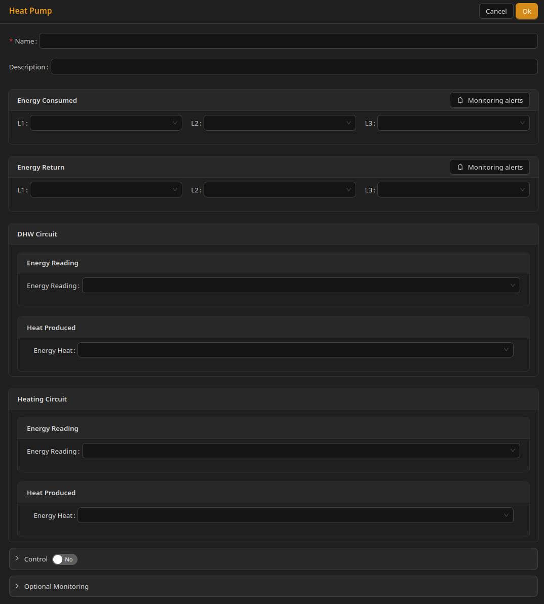

# Heating devices

# What is a heating device

Heating devices are a subtype of devices whose primary function is to generate heat. This category includes heat pumps, electric heaters (including pool water heaters), and domestic hot water (DHW) heaters.

Heating devices are one of the most power-hungry appliances often found in homes, as generating heat consumes a lot of energy. As such, they are a good target for energy optimization.

# How smart-grid ready heating devices operate

Many heating devices are already smart-grid ready, especially heat pumps and some DHW heaters.

Such devices typically control how much energy they use by switching between different temperature targets, rather than simply turning on or off.

Most commonly, two targets are used:

* Eco – a lower temperature that is still acceptable
* Comfort – a higher temperature that provides better comfort

In practice, this means:

* When energy is cheap, the Unwaste Robot may request Comfort mode. The device then tries to heat up to the higher temperature.
* When energy is expensive, the Unwaste Robot may request Eco mode. The device then limits heating and only maintains the lower temperature.

This approach allows the system to shift most energy usage to cheaper periods, while still keeping the building or water warm.

In well-insulated buildings, heat stored during cheap periods can often cover most needs during expensive periods. In reality, some energy is still used in Eco mode to prevent temperatures from dropping too low.

Some heating devices also support additional modes:

* Off (with freeze protection) – the device operates only to protect itself from freezing or damage. It may still consume a small amount of energy.
* Boost – the device intentionally heats beyond the normal Comfort level to store additional heat (for example in a buffer tank or DHW cylinder).

## Important safety note

Boost mode may be used **only if both the device and the heating installation support thermal energy storage**.

For DHW systems, Boost mode requires a **thermostatic mixing valve installed downstream of the hot water buffer**.

Without a mixing valve, excessively hot water may reach taps and pose a **risk of scalding**.

If these conditions are not met, Boost mode must be disabled.

---

# Heating circuits

A heating device may contain one or more **heating circuits**.

A heating circuit represents one functional heating loop inside the device (for example space heating or DHW). It is not an electrical circuit and does not correspond to circuits defined elsewhere in the system.

Examples:

* A heat pump may have one circuit for space heating and one for DHW.
* A pool heater typically has a single heating circuit.
* Electric space heaters (electric radiators, infrared heaters etc.) also have a single heating circuit.

---

## Configuration

At the device level, configure **Energy consumed** and optional **Energy return** like other devices.

Heating-specific readings are configured per **DHW circuit** and **Heating circuit** on the form.

---

### Energy consumed / Energy return (device level)

Optional. Total electrical energy for the whole device (L1 / L2 / L3 as for other devices).

---

### DHW circuit / Heating circuit

Each circuit section includes:

* **Energy reading** — electrical energy used by that circuit
* **Heat produced** — optional thermal energy produced (useful for COP analysis)

**Power flow** for the device is configured under **Optional monitoring**. See [Optional monitoring](../Optional%20monitoring.md).

---

## Control

Heating devices use the same control mechanism as other devices.

See [Device control](Device%20control.md) for details.

---

# Screenshot of a heat pump configuration

 

