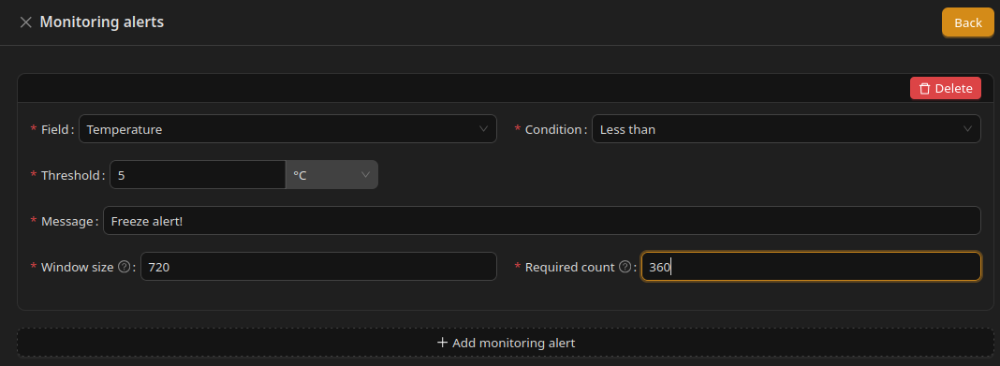
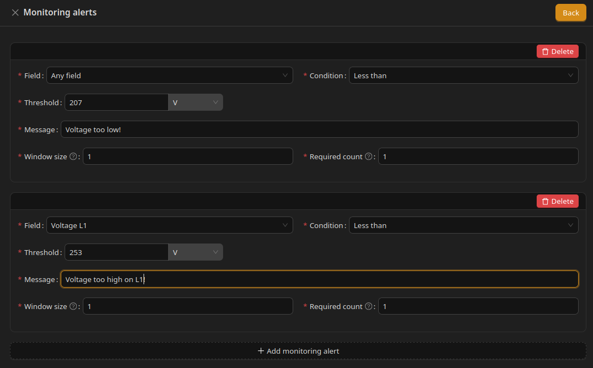
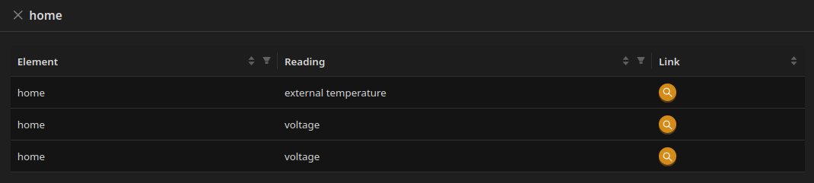

# Monitoring alerts

# What Are Monitoring Alerts

**Monitoring alerts** let you define conditions that generate user-visible alerts when a reading crosses a threshold.

Alerts can be configured on:

* main reading blocks (Energy Import, Energy Production, Energy Consumed, and similar),
* optional monitoring blocks (Voltage, Current, Power Flow, and similar),
* each entry in [Additional readings](Additional%20readings.md).

Alerts are for **monitoring and notification**. They do not change how the Unwaste Robot controls devices or storage.

---

# Configuring an Alert

Open **Monitoring alerts** on the reading block you want to watch. For each alert, configure:

* **Field** — which sensor or value to monitor (or **Any field** to watch all fields in that block)
* **Condition** — for example greater than, less than, or equal to
* **Threshold** — the limit value and unit
* **Message** — text shown when the alert triggers
* **Window size** — how many recent samples are considered
* **Required count** — how many samples in the window must match the condition before the alert fires

You can add multiple alerts on the same reading block.

---

# Viewing Alerts

Configured alerts appear in two places:

* **Design mode** — on the connection tile, use **MONITORING ALERTS** to see a list of all alerts defined for the installation (Element, Reading, Link to details).
* **Dashboard** (operational mode) — **Monitoring Alerts** section shows alerts that are currently active.

System alerts (for example missing dynamic prices) are shown separately from monitoring alerts configured by the user.

---

# Examples

* **Freeze alert** — Temperature less than 5 °C with message "Freeze alert!"
* **Low voltage** — Voltage L1 less than 207 V with message "Voltage too low!"
* **High voltage** — Voltage L1 less than 253 V (condition and threshold as appropriate for your installation)

---

# Screenshot (alert form)

 

---

# Screenshot (voltage alerts)

 

---

# Screenshot (alert list in Design mode)

 

