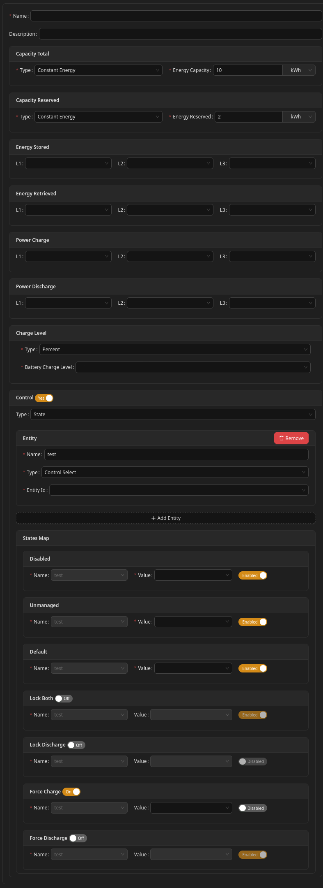

# Storage

# What Is an Energy Storage?

An energy storage is any device designed to store electrical energy.

The main role of a storage is to improve overall system efficiency by storing surplus energy and releasing it later when energy is needed.

Both standalone storage systems and storages integrated with hybrid inverters are supported, provided the Unwaste Robot can read their data and control their operating modes.

---

# Configuration

Configuring an energy storage can be relatively complex. This advanced configuration is intended mainly for devices that are **not** present in the database of compatible devices.

---

## Capacity Total

**Mandatory.**\nDefines the total capacity of the energy storage.

Available options:

* **Constant Energy** – enter a fixed capacity value in kWh
* **Reading Energy** – select a Home Assistant entity from which the total capacity is read, for batteries that have dynamic or configurable capacity.

---

## Capacity Reserved

**Mandatory.**\nDefines the portion of capacity that must always remain unused to protect the storage from degradation (see *Storage energy levels* in Notes).

Available options:

* **Constant Energy** – fixed reserved capacity in kWh
* **Constant Percent** – reserved capacity as a percentage of total capacity
* **Reading Energy** – Home Assistant entity providing reserved capacity in kWh, for batteries that have dynamic or configurable capacity.
* **Reading Percent** – Home Assistant entity providing reserved capacity as a percentage, for batteries that have dynamic or configurable capacity.

**Important:** Incorrect configuration may prevent charging or discharging.

---

## Energy Stored

**Mandatory.**\nDefines one or three Home Assistant entities (depending on storage type) used to read how much energy has been stored.

For a three-phase storage, you can provide:

* one sensor for summed energy (leaving the rest empty) - it must be specified in the L1 field
* three sensors, each corresponding to one phase - L1, L2, L3.

For a single-phase storage in a three-phase installation, only one field is used. It should correspond to the phase of the circuit the storage is connected to.

It is not the same as charge level.\nEnergy stored represents the total amount of energy charged into the storage over a longer period of time (across multiple charging cycles).

Charge level is current value of energy stored in storage.

---

## Energy Retrieved

**Mandatory.**\nDefines one or three Home Assistant entities (depending on storage type) used to read how much energy has been retrieved from the storage.

For a three-phase storage, you can provide:

* one sensor for summed energy (leaving the rest empty) - it must be specified in the L1 field
* three sensors, each corresponding to one phase - L1, L2, L3.

For a single-phase storage in a three-phase installation, only one field is used. It should correspond to the phase of the circuit the storage is connected to.

Energy retrieved represents the total amount of energy retrieved from the storage over a longer period of time (across multiple discharging cycles).

---

## Power Charge

**Optional.**\nDefines one to three entities used to read the current charging power.

For a three-phase storage, you can provide:

* one sensor for summed power (leaving the rest empty) - it must be specified in the L1 field
* three sensors, each corresponding to one phase - L1, L2, L3.

For a single-phase storage in a three-phase installation, only one field is used. It should correspond to the phase of the circuit the storage is connected to.

---

## Power Discharge

**Optional.**\nDefines one to three entities used to read the current discharging power.

For a three-phase storage, you can provide:

* one sensor for summed power (leaving the rest empty) - it must be specified in the L1 field
* three sensors, each corresponding to one phase - L1, L2, L3.

For a single-phase storage in a three-phase installation, only one field is used. It should correspond to the phase of the circuit the storage is connected to.

---

## Charge Level

Defines the entity used to read the current charge level of the storage.

The charge level can be provided as:

* "None" - no charge level reading available
* "Energy" - an **energy value** (kWh), or
* "Percent" - a **percentage value**

See *Storage energy levels* in Notes for details.

Charge level is optional, but it is needed to properly control a storage (as without it the energy in a storage cannot be accounted for in algorithms).

It is not always equal to total energy stored minus total energy retrieved, as all storages experience some energy loss.

---

## Control

---

## Enabling Control

To allow the Unwaste Robot to control a storage, control must first be enabled.

Without enabled control, device is only monitored and it would remain in "Unmanaged" mode.

Next, you need to select type of control:

* "None" - no control available. It is like a disabled control, but not the same. 
* "State" - storage is controlled via setting states for each mode. Control entities must be selected, and finally values must be defined for each entity and for each supported control mode (or disabled for specific modes if required).

The selected control type determines whether the **States Map** section is available for configuration.

Note: "None" and "Disabled" are separate concepts and serve different purposes.

"None" tells us that there is no control available at all, which is useful, as empty "State" form would complain for missing values.

"Disabled" allows to temporarily disable control, without losing all the configuration stored in "State" form.

---

## Selecting Entities

The first step is selecting which Home Assistant entities are used to control the storage.

Two types of control entities are supported:

---

### Switch Entities

Switch entities accept a simple on/off (true/false) value, similar to a light switch.

---

### Select Entities

Select entities allows choosing one value from a predefined list, for example selecting an operating mode supported by the device.

---

## Storage Control Modes

A storage can operate in one of the following modes:

* **Disabled mode** – the storage is temporarily disabled by user or the Unwaste Robot
* **Unmanaged mode** – the storage is not controlled by the Unwaste Robot
* **Default mode** – the storage follows its internal logic - used when device is managed, but there is no need for any action.
* **Force charge** – the storage is instructed to charge from the grid
* **Force discharge** – the storage is instructed to discharge to the grid (not yet used)
* **Lock discharge** – the storage is told to not discharge (not yet used)
* **Lock both** – the storage is told to not charge or discharge (not yet used)

The three modes marked as "not yet used" are not used in current model of storage control, but these will be implemented in the future, and exist in configuration so users wouldn't be forced to fill in the gaps in the future.

---

## Selecting Values for Each Mode

Each control mode can be configured independently. For each mode we are setting a "state" - that is a collection of values for each control entity. When a mode becomes active, all enabled control entities for that mode are set simultaneously.

For each mode:

* enable or disable the mode using the switch next to its name (if available)
* define what value should be set to each control entity, or disable a specific entity for that mode

Note: Each state must have at least one entity enabled.

Note 2: (important) If a storage doesn't support selected mode, it applies **Default mode** instead.

---

# Important Notes

---

## Storage Energy Levels

Each storage defines two capacity values:

* **total capacity** – the theoretical maximum energy the storage can hold
* **reserved capacity** – the minimum energy level that must remain to protect storage health

Based on these values, the system distinguishes:

* **energy in storage** – the raw reported energy value
* **available energy in storage** – energy in storage minus reserved capacity

Important:\nIf a storage device already subtracts the reserved capacity internally, configure the total capacity accordingly and set reserved capacity to zero.

## Power flow

### Typical case

Separate power charge and power discharge parameters are the most common way in storages to determine total power flow, as these are intuitive to configure and unambiguous. We calculate the difference between them to present total power flow of a storage on a graph.

### Ambiguous devices

But there are storages that supply only one value, and what is even worse, it does not always follow the same convention of direction of power flow.

In such cases, total power flow should be entered into one of these fields (leaving second one blank), and if the direction is incorrect on the graph, then you need to swap these fields.

Single phase readings for these parameters shouldn't be mixed with three phase readings.

# Screenshot

 

\