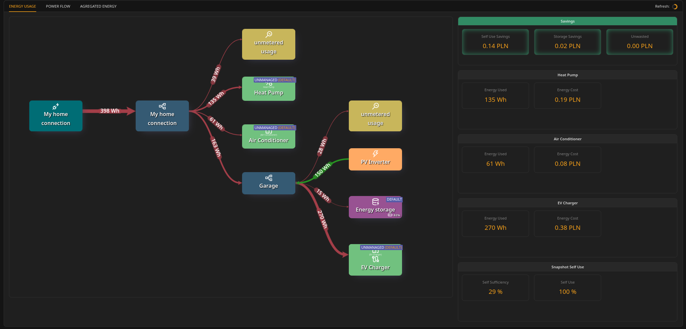

# Energy Usage view

### What the Energy Usage view shows

The **Energy Usage** view shows accumulated energy flows for **today** (midnight to now), for the periods when the system was **STARTED**.

**Note: STOPPED periods**\nIf the Unwaste Robot was **STOPPED** during the day, the Energy Usage view reflects only the periods when it was **STARTED**. Missing time is not recorded.\nSee **System operation → Starting and stopping the Unwaste Robot**.

It is a "daily picture" of how energy moved through the installation:

* from grid connection into circuits and devices,
* from production sources into circuits,
* into and out of storage,
* and any residual (unmetered) usage.

 

---

### Energy flow diagram

The diagram shows components (nodes) and net energy transfer (lines):

* **Line label (Wh, kWh)** represents how much energy moved between nodes.
* The arrow direction represents **net flow** over the day so far.
* Some nodes can be bidirectional:
  * circuits,
  * storage.

**Colors and direction**

* **Red** indicates net flow in the "normal consumption direction" (typically from root towards loads).
* **Green** indicates net flow in the opposite direction (typically production flowing back into the installation).

**Important: net flow concept**\nFor bidirectional elements, the view shows *net* results, not both directions simultaneously.

Example:

* Storage charged 3 kWh and discharged 1 kWh today.
* The diagram shows 2 kWh net flow in the discharge direction (storage → circuit).

Some elements have fixed direction by design:

* Production sources (e.g., PV inverter) only produce energy → arrow always points away from the inverter.
* Devices only consume energy → arrow always points towards the device.

---

### Unmetered usage

"Unmetered usage" is a calculated residual and appears only under specific conditions:

* It appears when a circuit has its own meter, and
* measured circuit energy is higher than the sum of all measured elements connected to it.

This typically indicates energy usage in that circuit that is not represented by separately metered devices.

**Important limitation**

* If the residual would be negative (for example due to an unmetered production source), it is not shown.\nNegative "unmetered usage" would be confusing and would suggest that "usage" can produce energy.

---

### Savings panel

The view shows three savings values:

* **Self Use Savings**
* **Storage Savings**
* **Unwasted**

These are always shown, even if currently zero, to keep the view consistent across installations.

For how these savings are computed and what is estimated vs measured, see *Inner workings → Savings calculation*.

---

### Per-device panels

Devices are always listed in the right panel, even if a device used 0 Wh today.\nThis makes it easier to confirm that a device exists in the installation and is part of the model.