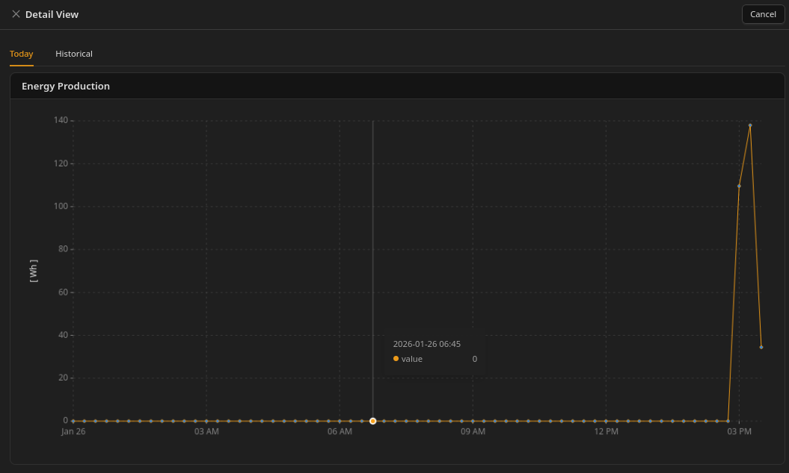
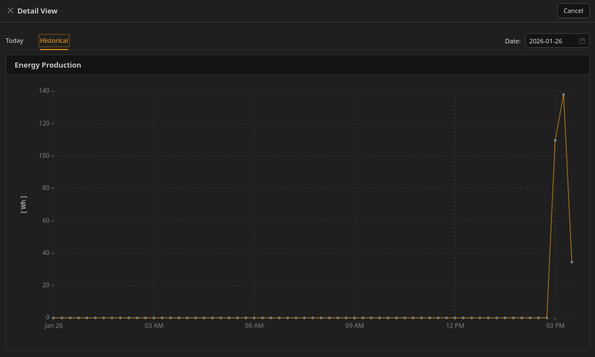

# Viewing statistics and graphs

### How to open graphs

Graphs are opened using the **Statistics** button available on most components.

 

**Important:**\nStatistics are available for all components except **connections**, because a connection does not have its own direct readings. Readings are taken from the **main circuit**.

---

### What graphs can show

The set of available graphs depends on:

* the type of object (device vs storage vs inverter),
* and the readings configured for that object.

In general:

* each configured reading can have its own graph,
* some calculated values may also have graphs.

---

### Today and Historical graphs

 

 

For Energy Usage and Power Flow statistics:

* "Today" uses 15-minute aggregated periods.
* "Historical" also uses 15-minute periods but allows selecting a single past day.
* If the system was STOPPED for part of a day, those periods appear as **zero** values to keep the timeline continuous.

**Note:** STOPPED periods appear as zeros in "Today" and "Historical" graphs to keep the timeline continuous. This does not mean "zero consumption", it means the system was not collecting data.\nSee **System operation → Starting and stopping the Unwaste Robot**.

---

### Aggregated Energy graphs and grouping

In Aggregated Energy statistics:

* the time range is inherited from the selected date span in the Aggregated Energy view,
* the user can change the grouping interval:
  * 1 hour, 2 hours, 4 hours, 6 hours, 12 hours, 1 day.

 

---

### Important limitations

* All graphs show **aggregated values**, never raw 5-second samples.
* The system collects 5-second readings, but stores only 15-minute (or higher) aggregates for history.