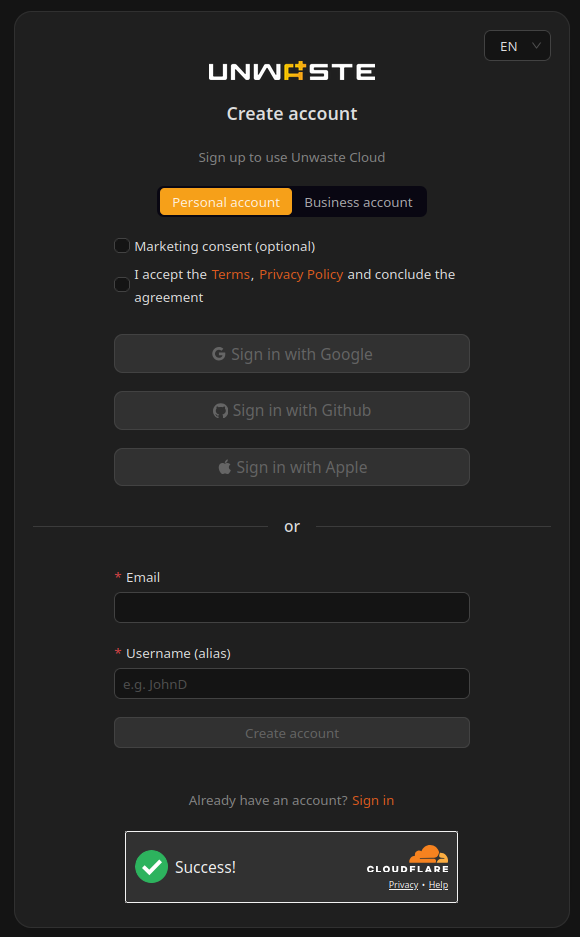
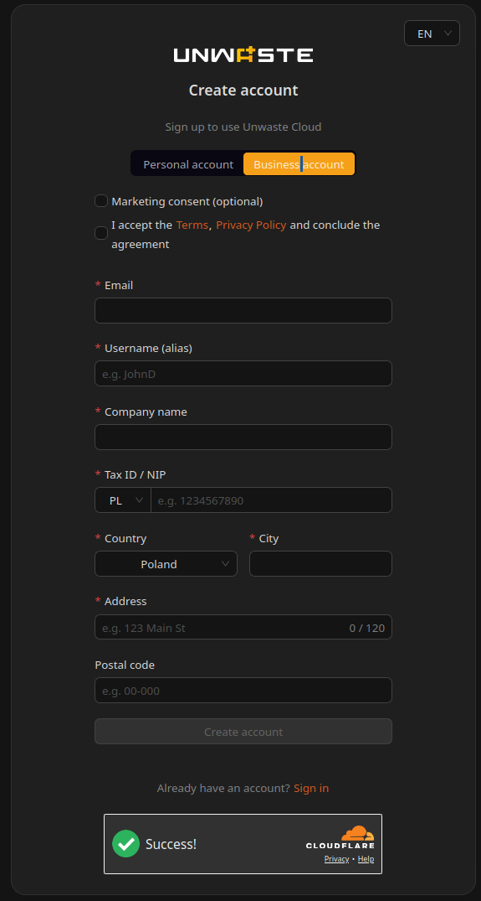

# Creating account

## Creating a Cloud Account

### Overview

A **Cloud Account** allows you to use cloud-based functionality of the Unwaste system, including energy tariffs, remote access, sharing, and mobile app access.

Creating an account is performed in a web browser. The registration process is the same whether you start it:

* directly from the Unwaste Cloud website, or
* during the process of connecting the Unwaste Robot to the cloud.

***

### Account Types

During registration, you can choose between:

* **Personal account**
* **Business account**

 

***

### Creating a Personal Account

A Personal account can be created using one of the following methods:

* **Google**
* **GitHub**
* **Email address**

If you choose Google or GitHub, authentication is handled by the selected provider.

If you choose email-based registration, you must provide:

* Email address
* Username (used only for personalization in the interface and emails)

The username is not required to be unique and can be changed later.

***

### Creating a Business Account

A Business account is created using email-based registration.

You must provide:

* Email address
* Username
* Company name (required)
* Tax ID / NIP (required)

At present, company name and Tax ID are required fields but are not subject to additional format validation.

***

### Email Verification (Passwordless Login)

The Unwaste Cloud uses a passwordless authentication model.

After submitting the registration form:

1. A 6-digit verification code is sent to the provided email address.
2. Enter the code in the verification field.

Verification rules:

* The code is single-use.
* The code expires after 5 minutes.
* There is no dedicated “resend” option. If the code expires, the registration form must be submitted again.
* Multiple failed attempts may trigger anti-spam verification.

If the provided email address already has an existing account, the system logs the user in instead of creating a duplicate account.

***

### Required Consents

Before creating an account, you must:

* Accept the **Terms of Service** and **Privacy Policy** (mandatory).

You may optionally:

* Provide marketing consent (used for product or newsletter emails).

Account creation is possible without granting marketing consent.

***

### After Registration

After successful email verification:

* You are automatically logged in.
* You are redirected to the Cloud dashboard.
* After account creation, the dashboard is initially empty, as no Unwaste Robots are connected to the account yet.

There is currently no onboarding wizard or setup guide shown after first login.

***

### Notes

* Account creation is available globally via web browser.
* Registration does not require setting a password.
* Personal and Business accounts currently provide the same feature set.
