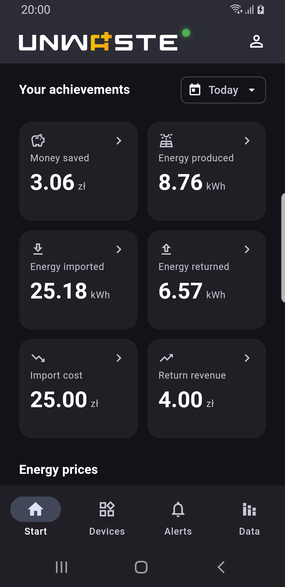

# Mobile application

The Unwaste mobile app is available for Android and iOS devices. Download it from Google Play or the App Store.

The mobile app has fewer features than the web interface. You can switch modes, configure schedules and alerts, and view data.

<figure><figcaption></figcaption></figure> <figure><figcaption></figcaption></figure> <figure><figcaption></figcaption></figure>

