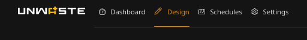
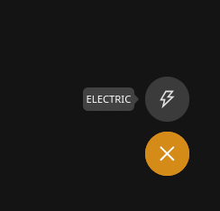
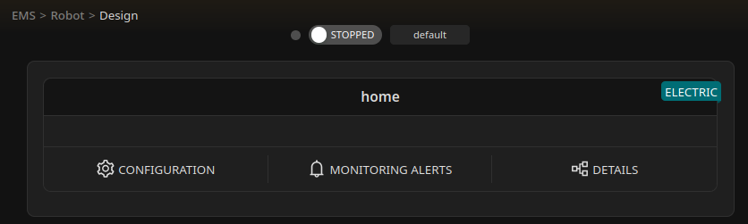
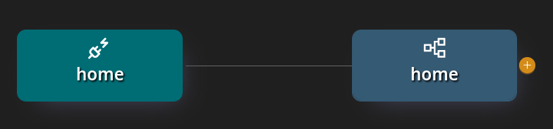
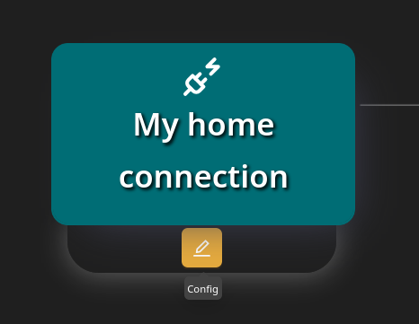
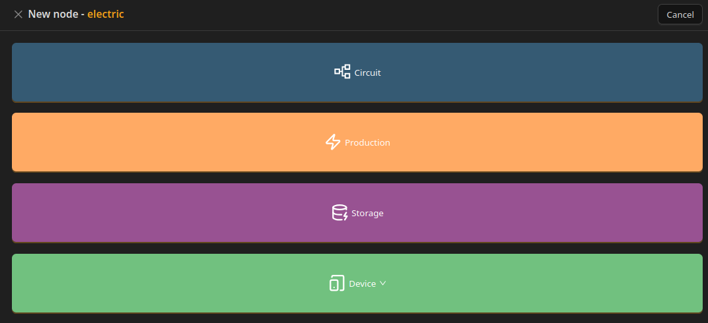
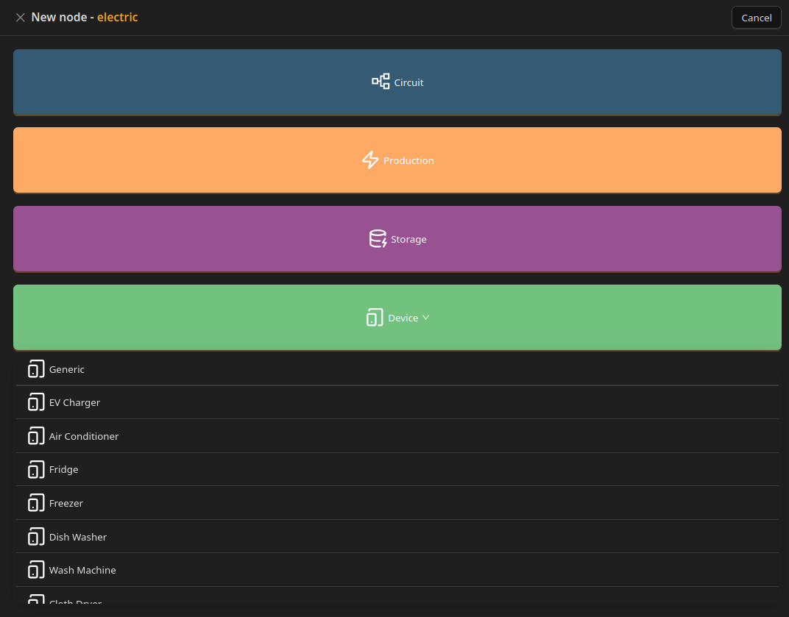
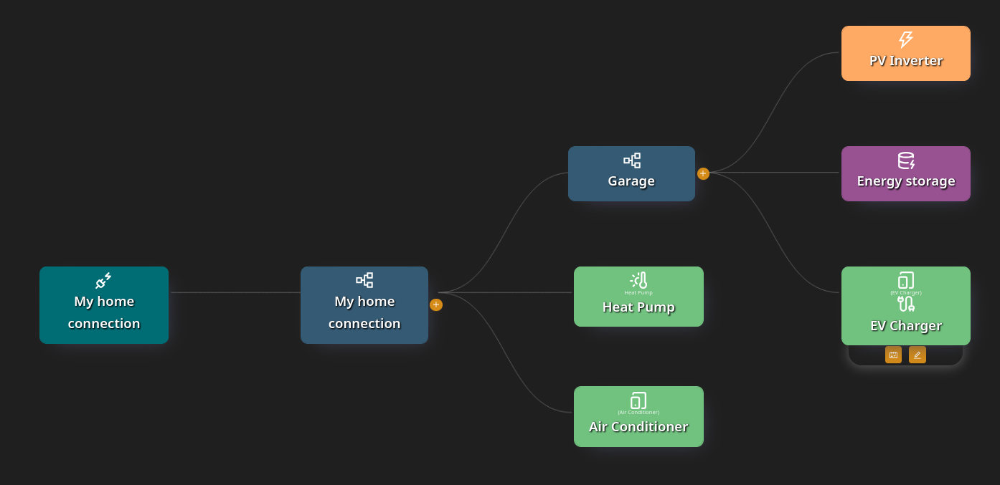

# Designing your electrical installation

### What this is about

This section explains how to design the structure of your electrical installation for the **Local Unwaste Robot**.

You are not configuring individual devices here. Instead, you are describing **how energy flows through your installation** so the Unwaste Robot can:

* understand where energy comes from,
* understand where energy is consumed or stored,
* and decide when and how to manage energy based on prices and availability.

The result is a logical model of your installation, not a wiring diagram.

***

### Before you start

Before designing your installation:

* Your devices, sensors, and integrations must already be correctly configured in **Home Assistant** or **Unwaste OS.**
* Devices you add here must already exist and report data or accept control commands in Home Assistant.
* This section does not replace electrical design or safety requirements.

***

### Core building blocks

An electrical installation in Unwaste consists of the following elements:

* **Connection** — represents a physical connection to the power grid and defines energy prices (tariffs) and forecasts. Currently, the system only supports electrical connections. In the future, support for other connections, such as gas connections, is planned.
* **Circuit** — represents a part of the electrical installation where energy flows are measured.
* **Production source** — represents devices that generate electricity (for example, a PV inverter).
* **Energy storage** — represents devices that can store electrical energy (for example, a battery).
* **Device** — represents an energy consumer that can be monitored and optionally controlled.

These elements form a **tree structure** called the _installation graph_.

***

### Minimum vs functional configuration

#### Minimum configuration (monitoring only)

The minimum configuration always consists of:

* one **connection**
* one **main circuit** (created automatically)

With only these elements:

* the Unwaste Robot **does not perform optimization**
* it can only **monitor energy usage**, if readings are configured on the main circuit

This setup is valid, but passive.

#### Functional configuration (active management)

To enable active behavior, you must add **at least one managed element**, such as:

* a controllable device, or
* an energy storage with control enabled

Without a managed element, the Unwaste Robot has nothing to act on.

#### Sub-circuits

**Sub-circuits are optional.**

In most homes, a single main circuit is sufficient, and no sub-circuits are required.

Sub-circuits are useful when you want to:

* measure energy usage in specific areas (for example garage, apartment, workshop, individual rental rooms),
* separate large or independent loads,
* model complex installations with multiple distribution points.

Sub-circuits are usually unnecessary when:

* you only care about total household consumption,
* all managed devices are connected to the same electrical distribution,
* detailed per-area reporting is not required.

Adding sub-circuits improves visibility, but is not required for energy optimization.

#### Typical home installation

A typical home installation usually includes:

* one connection
* one main circuit (no sub-circuits)
* a production source (if PV is installed)
* an energy storage (if present)
* one or more controllable devices (for example heating or EV charging)

***

### Design flow overview

Designing an installation always follows the same order:

1. Create a connection (with tariffs)
2. Use the automatically created main circuit
3. Optionally add sub-circuits
4. Add production, storage, and devices to circuits

All elements except the connection are always attached to a circuit.

***

### Step-by-step: designing your installation

#### 1. Enter Design mode

From the top navigation, select **Design**.

The Design dashboard is where all installations are created and managed.

***

#### 2. Add your first connection

In an empty Design dashboard, a **plus (+) button** is visible.

When you hover over it, available connection types are shown.

Currently, only **electric connections** are available. Other connection types may be added in the future.

***

#### 3. Configure the connection

After selecting an electric connection, a **connection configuration form** is displayed.

This is where you define:

* tariffs,
* forecasts,
* optional **Surplus mode** (for PV installations),
* and other connection-level settings.

These settings apply to the entire installation connected to this grid connection.

(Details of these parameters are described in the [Connection](connection.md) section of the documentation)

***

#### 4. Return to the Design dashboard

After saving the connection, you return to the Design dashboard.

The connection now appears as an entry.

Visible actions:

* **Configuration (gear icon)** — Shortcut for editing connection parameters (for example tariffs) without entering the installation graph.
* **Monitoring alerts** — List of all monitoring alerts defined for this connection (Element, Reading, link to details). See [Monitoring alerts](optional-monitoring/monitoring-alerts.md).
* **Design** — Opens the installation graph for this connection.

Click **Design** to continue.

***

#### 5. Installation graph: initial state

The installation graph opens.

The graph initially contains:

* the **connection**
* the **main circuit**, automatically created and connected to the connection

Important rules:

* The main circuit is mandatory
* It cannot be deleted or replaced
* It can be renamed
* It is always connected directly to the connection

***

#### 6. Editing and scheduling elements

When you hover over elements in the installation graph, additional icons appear.

Visible actions:

* **Edit icon** — Opens configuration of the selected element.
* **Schedule icon (devices only) -** Allows you to configure schedules for controllable devices.

Only devices expose scheduling, because only devices can be managed directly by the Unwaste Robot.

***

#### 7. Adding elements to circuits

Circuits display a **plus (+) icon**.

Clicking it opens a selector that allows you to add:

* a sub-circuit
* a production source
* an energy storage
* a device (with subtype selection)

Rules:

* The same selector is used at every circuit level
* Connections cannot be added here — they are always the root of an installation
* Production, storage, and devices can be attached at **any circuit level**

***

#### 8. Example of a more advanced installation

A more advanced home installation may include:

* multiple sub-circuits
* shared circuits for production and storage
* devices grouped by location or function

This example is shown for inspiration. Your installation does not need to be this detailed to work correctly.

***

### Important notes

* The installation graph represents **logical energy flow**, not physical wiring.
* Adding more structure improves insight and optimization, but is optional.
* Devices added here must already be correctly configured and functional in Home Assistant.
* This configuration does not replace proper electrical design or safety systems.
