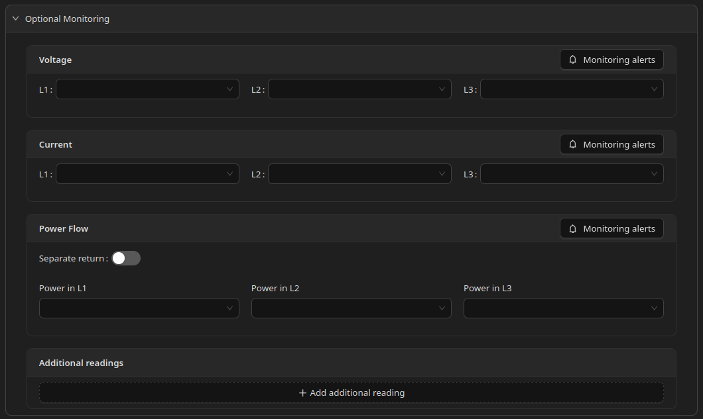
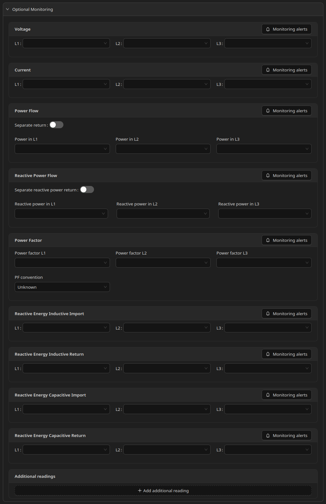

# Optional monitoring

## Optional monitoring

## What Is Optional Monitoring

**Optional monitoring** is a collapsible section available on circuits, production sources, energy storage, and devices.

It lets you configure additional electrical readings beyond the main energy fields on each form. These readings are used for **graphs, statistics, and monitoring alerts**. They do not affect device or storage control unless you configure [Monitoring alerts](monitoring-alerts.md) on them.

Optional monitoring is described once here. Individual element pages (Circuit, Production, Storage, Device) link to this section instead of repeating the same details.

***

## Where It Is Available

| Element               | Optional monitoring        |
| --------------------- | -------------------------- |
| Circuit               | Yes (full set — see below) |
| Production (inverter) | Yes                        |
| Energy storage        | Yes                        |
| Device                | Yes                        |
| Connection            | No                         |

***

## Common Readings

The following blocks appear on circuits, production sources, storage, and devices (where applicable).

Each block has a **Monitoring alerts** button. Alert configuration is described in [Monitoring alerts](monitoring-alerts.md).

### Voltage

Optional Home Assistant sensors for voltage on **L1**, **L2**, and **L3**.

### Current

Optional Home Assistant sensors for current on **L1**, **L2**, and **L3**.

### Power Flow

Optional Home Assistant sensors for instantaneous power.

For three-phase elements, you can provide:

* one sensor for summed power (in the L1 field, leaving L2 and L3 empty), or
* three sensors — one per phase (L1, L2, L3).

**Separate return** — when enabled, you can configure separate sensors for power flowing in and power flowing out.

***

## Readings Available Only on Circuits

Circuits include additional optional blocks not shown on other element types:

* **Reactive Power Flow** — with optional **Separate reactive power return**
* **Power Factor** — per phase (L1, L2, L3), plus **PF convention**
* **Reactive Energy Inductive Import**
* **Reactive Energy Inductive Return**
* **Reactive Energy Capacitive Import**
* **Reactive Energy Capacitive Return**

For three-phase circuits, each block follows the same L1 / L2 / L3 rules as energy import.

***

## Additional Readings

At the bottom of Optional monitoring, **Additional readings** lets you add a custom list of extra sensors (temperature, irradiance, and others).

This is a separate mechanism from the fixed blocks above. See [Additional readings](additional-readings.md) for details.

***

## Phase Rules

The same phase rules apply as for main energy readings:

* You may use **one total sensor** (assigned to L1, with L2 and L3 empty) or **three per-phase sensors**.
* Do not mix a total sensor with per-phase sensors in the same block.
* L1, L2, and L3 labels must be used **consistently** across the installation (main circuit, sub-circuits, and devices).

See [Circuit](../circuit.md) for more on phase consistency.

***

## Screenshot (standard)

***

## Screenshot (circuit — extended set)

