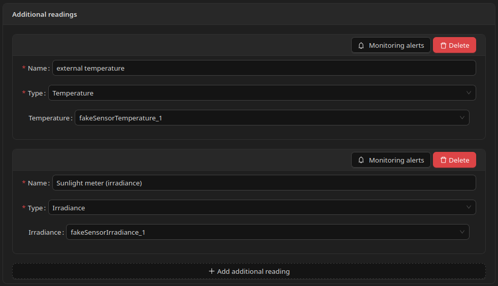

# Additional readings

## Additional readings

## What Are Additional Readings

**Additional readings** let you attach extra Home Assistant sensors to a circuit, production source, storage, or device.

Each entry has:

* a **Name** (your label for this reading),
* a **Type** (determines which sensor field is shown),
* the corresponding **Home Assistant entity**.

Additional readings appear in graphs and statistics when configured. They can also have [Monitoring alerts](monitoring-alerts.md).

Additional readings are configured inside the **Optional monitoring** section on each element form. See [Optional monitoring](./) for where to find this section.

***

## Supported Types

When you add an additional reading, you choose a type. Available types include:

* **Energy** (single-phase or three-phase)
* **Power**
* **Reactive power**
* **Voltage**
* **Current**
* **Temperature**
* **Irradiance**
* **Heat produced**
* **Battery**
* **Power factor**
* **Reactive energy** (three-phase)

The form shows entity selectors matching the selected type.

***

## Common Examples

### Irradiance (solar installations)

If you have a pyranometer or similar sensor, add an additional reading of type **Irradiance**.

The system can display a sunlight chart. This is for reference only and does not affect control decisions.

This replaces configuring irradiance as a separate top-level field on the inverter form.

### Temperature

Add a reading of type **Temperature** to monitor ambient, buffer, or panel temperature alongside energy data.

***

## Monitoring Alerts

Each additional reading has its own **Monitoring alerts** button. See [Monitoring alerts](monitoring-alerts.md).

***

## Screenshot

