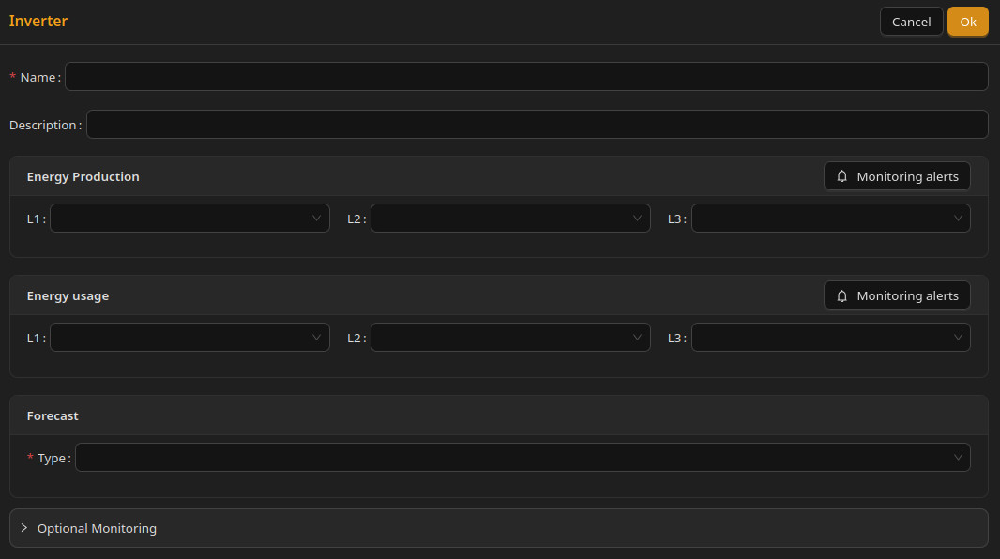

# Production

## Production

## What Is a Production Source

A production source is a device that generates electricity.

At the moment, the system supports solar installations (solar panels connected to an inverter). In the future, support will be extended to other energy sources such as small wind turbines, hydro power, and generators.

***

## Inverter Configuration

Configuring an inverter requires **Energy production** and **Energy usage** readings. Other fields add forecasts and optional monitoring.

***

### Name and Description

**Name** is required. **Description** is optional.

***

### Energy Production

This setting defines where the system gets information about how much energy is being produced.

You simply select a Home Assistant sensor that measures energy production.

This setting is **required**.

For a three-phase inverter, you can provide:

* one sensor for summed production (leaving the rest empty) - it must be specified in the L1 field
* three sensors, each corresponding to one phase - L1, L2, L3.

For a single-phase inverter in a three-phase installation, only one field is used. It should correspond to the phase of the circuit the inverter is connected to.

Only energy sensors would be available on this list.

Use **Monitoring alerts** on this block if needed. See [Monitoring alerts](optional-monitoring/monitoring-alerts.md).

***

### Energy Usage

This setting defines where the system reads **on-site self-consumption** of produced energy — how much generated energy is used within the installation rather than exported.

This setting is **required**.

For a three-phase inverter, the same L1 / L2 / L3 rules apply as for Energy production.

***

### Production Forecast

This setting allows you to select a sensor that provides a **forecast of expected energy production for the rest of the current day**.

You can use any forecast source that is compatible with the Home Assistant Energy Dashboard.

The forecast is mainly used to help the system make better decisions about energy storage, such as estimating whether solar production will be sufficient to cover the day's energy needs.

As of now, the system supports only two forecast types:

* "None", meaning no forecast is available. When _None_ is selected, the system operates without production forecasts and relies only on real-time measurements.
* "Direct", which means a direct reading of forecast configured in Home Assistant.

In Direct type, you must choose one of available forecast entities, compatible with Home Assistant's Energy Dashboard. It must show remaining energy production for the current day.

Note 1: Forecast quality directly affects battery and load optimization decisions. Inaccurate forecasts can significantly affect battery charging decisions and export vs self-consumption optimization, potentially reducing expected savings.

Note 2: This is a different forecast than Energy usage Forecast (defined in Connection), but both of them are used for controlling a storage.

***

#### Forecast Options

The most commonly used forecast sources are:

**1) Solcast**

The most accurate option, typically within a 5–10% error range. Requires a paid Solcast API key.

**2) Open Meteo Solar Forecast**

A free option based on the Open-Meteo service. Generally reliable and the best choice among free alternatives, though less accurate than Solcast.

**3) Forecast.Solar**

Built into Home Assistant and free to use. Less accurate, especially on cloudy days and during winter, as it often overestimates production.

***

### Optional Monitoring

Instantaneous power, voltage, current, irradiance, and other extra sensors are configured under **Optional monitoring** on the inverter form.

* **Power flow** and other electrical readings — see [Optional monitoring](optional-monitoring/)
* **Irradiance** and custom sensors — add via [Additional readings](optional-monitoring/additional-readings.md) (type Irradiance)

***

## Screenshot

