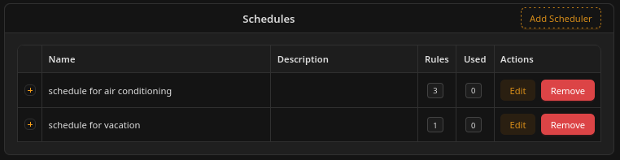
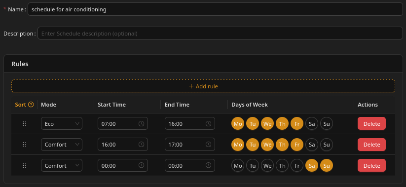
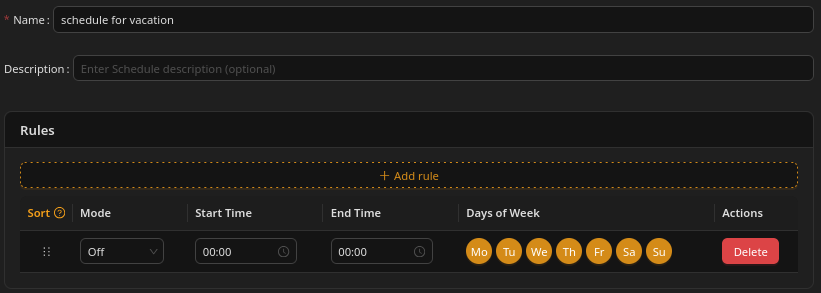
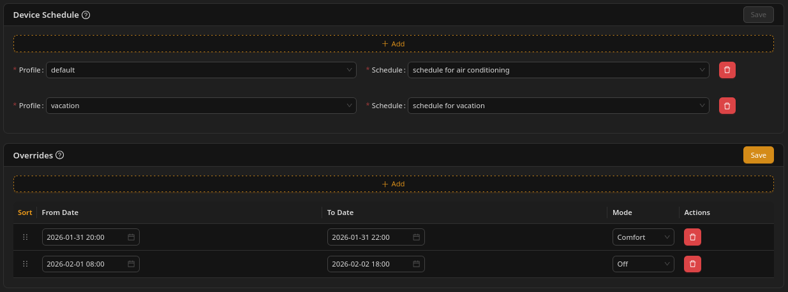

# Schedules

## Schedules

## What is a schedule

A schedule is a set of rules that override default device behavior.

These rules consist of a defined repeatable timespan and assigned mode.

For example, these are valid rules:

* in the workdays (Monday-Friday) set Eco Mode from 7am to 4pm - what would be the rule to turn air conditioning in home off when you are off to work
* in the workdays (Monday-Friday) set Comfort mode from 4pm to 5pm (e.g., to prepare air conditioning for your return at 4:30pm).
* set Off mode (without any other conditions) - that would be rule to assign to devices for "vacation" profile only

Schedules override default, price-based behavior for their active time ranges.

Overrides > Schedules > Default (price + surplus)

### Important notes

* It is important to note that a schedule itself does not define which device has to have this mode set, so **by itself it doesn't do anything**. But thanks to this you can assign the same schedule to many different devices, effectively "reusing them" as many times you need.
* When a schedule is active, the Unwaste Robot does not adjust the mode based on energy prices for that time period. It means that by setting a schedule, you may limit possibility to generate savings.

### **How schedules are applied**

* Schedules are **reusable templates** (a list of rules with times and desired signals).
* A schedule is **not applied globally** and is **not attached to a profile directly**.
* Instead, schedules are applied **per device and per profile**:

**Rule:** For each device, you can select **one schedule for each profile**.\nWhen you activate a profile, the Unwaste Robot uses the schedule selected for that profile **for each device**.

**Example**

* You have two profiles: **Home** and **Away**.
* For the **Heat pump** device:
  * Home → "Comfort evenings" schedule
  * Away → "Eco all day" schedule
* For the **Water heater** device:
  * Home → "Hot water mornings" schedule
  * Away → no schedule (default, price based logic)

Result:

* When you switch from Home to Away, the active schedule **changes per device** based on what you selected for that device in the Away profile.

**Important**

* If a device has no schedule selected for the active profile, it will not receive **schedule-based** signals for that profile. Instead, it will operate using the **default, price-based logic**. If an **override** is active for that device, the override takes precedence.

## **Timing behavior**

* Schedule rules are evaluated at fixed system intervals (for example every 15 minutes).
* When a schedule rule becomes active (for example, because the profile it is attached to becomes active), the Unwaste Robot sends the corresponding control signal at the next evaluation interval.
* If multiple schedule rules match at the same time, the **last matching rule in the schedule order is applied**.
* **Only schedules attached to the currently active profile are evaluated.**
* When the active profile changes, schedules attached to the newly selected profile become effective at the next evaluation interval.
* For more details, see _Timing behavior_ in the introduction.

Example: Switching from "Home" to "Vacation" profile immediately changes which schedules are evaluated, but control signals are still sent at the next evaluation interval.

## Where to find schedules

Schedules have their own link in main menu.

## Configuring schedules

To define a schedule, you have to create it using "Add Scheduler" button, choose its name and then you will have to add all rules for this schedule.

### Rules

Each rule consists of:

* Mode - that is to be used when time conditions are met
* Start Time - beginning of time span when the rule is active
* End Time - end of time span when rule is active
* Days of Week - defines in which days of the week this rule applies

#### Notes

* both Start Time and End Time allow to define hour and a quarter, just like basic time period the system itself operates on
* entering 00:00 as Start Time means midnight STARTING this day
* entering 00:00 as End Time means midnight ENDING this day
* if both Start Time and End Time are 00:00, it means "all day"
* schedules match by **day of week and time only** — they do **not** support public holidays or one-off calendar dates; a rule for "Monday–Friday" applies on every Monday through Friday, including holidays that fall on those weekdays

### Rules precedence

You can freely change rules order (by dragging them up and down the list using 6-dot marker to the left of Mode).

Ordering of rules is important, because rules are evaluated in the order shown in the list. If multiple rules match, the one defined last in the list is applied.

You can think of it like the further up the list the rule is positioned, the more general rule it is, and the lower - the more specific, like an exception from the above rules. That's why the last matching rule is taken as **the most important**.

### Example 1 - schedule for air conditioning

### Example 2 - schedule for vacation

## Attaching schedules to devices

### Where to find it

To attach schedule to a device, you need to use schedule icon in device details. When you move mouse pointer over a device (in a design mode or in dashboard mode), a small panel with icons will show. One of these icon allows you to enter Schedules and Overrides tab for this device

### Attaching schedules

On schedules and overrides tab, you can attach one schedule per each profile you have defined, by selecting "add" on schedules list, selecting a profile and a schedule and saving. You are then declaring "when this profile is selected, use this schedule for this device".

Not attaching a schedule to a profile is completely valid option - when this mode would be selected, the device would operate without schedule, using modes calculated by the Unwaste Robot.

Also, schedules are meant to be reused. You can use the same schedule for different profiles (if it matches your setup) and for different devices.

That way, as in our example, you can attach the same schedule turning devices off for vacation period to a vacation profile in many different devices, that way with one click (choosing vacation profile as active) you can turn all devices off.

Also, you can have a different but similar profiles, where you would reuse the same schedules for all but some devices.

### Example

This example covers setting two schedules defined previously to an air conditioner, using two appropriate profiles. (also it shows overrides, but it will be covered in the next section).

