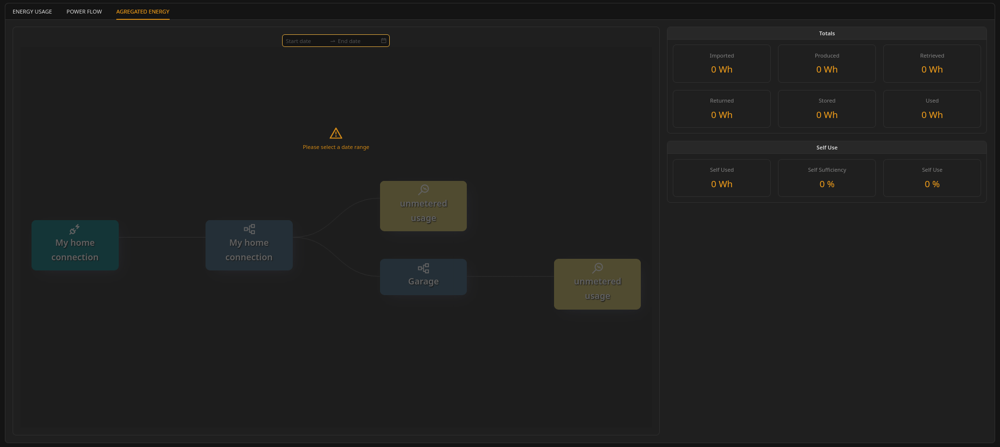
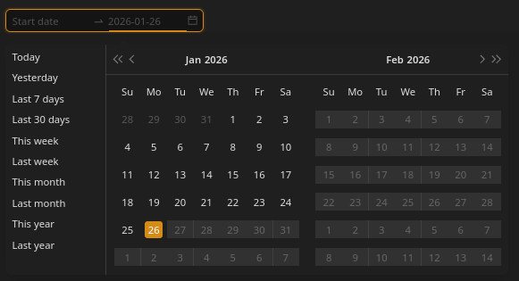
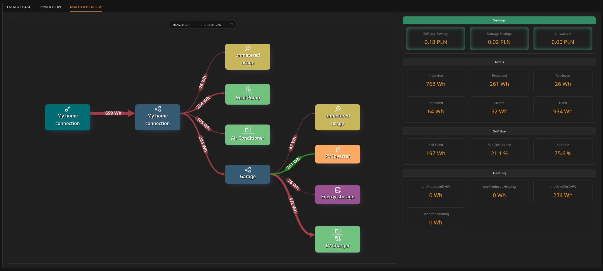

# Aggregated Energy view

### What the Aggregated Energy view is

The **Aggregated Energy** view allows the user to review historical energy totals over a selected time range (days, weeks, months).

It answers: "What were the totals over this period?"

***

### Selecting a date range

* The selection is based on **full days**.
* Start and end dates are **inclusive**.
* Presets are available (Today, Last 7 days, This month, etc.).

**Important:** If the system was STOPPED during part of the selected period, those missing intervals are excluded from totals.

See **System operation → Starting and stopping the Unwaste Robot** for details.

***

### Aggregated results

All values shown are **sums over the selected time range**.

***

#### Totals panel

Definitions:

* **Imported** – energy taken from the grid into the installation.
* **Returned** – energy exported from the installation back to the grid.
* **Produced** – energy generated by local sources (e.g., PV inverter).
* **Stored** – energy put into storage (charging).
* **Retrieved** – energy taken from storage (discharging).
* **Used** – energy consumed by loads.

***

#### Self Use panel

These values are computed using the **same self-use logic as daily views**, but applied across the entire selected range.

**Important:** Self-used energy is calculated per 15-minute interval and then summed. This avoids misleading conclusions that can happen if production and consumption occur at different times of day. See Unwaste Robot Operation _→ Technical details  → Self-use calculation_ for details.

***

#### Heating panel

This panel appears only if at least one heating-class device exists in the installation.

Fields currently shown:

* **Used for Heating**
* **Heating produced**
* **Used for DHW heating**
* **DHW heat produced**

***

### Savings

Savings in this view apply to the selected historical time range. See _Inner workings → Savings calculation_ for the meaning and limitations (especially the estimated part of "Unwasted").
