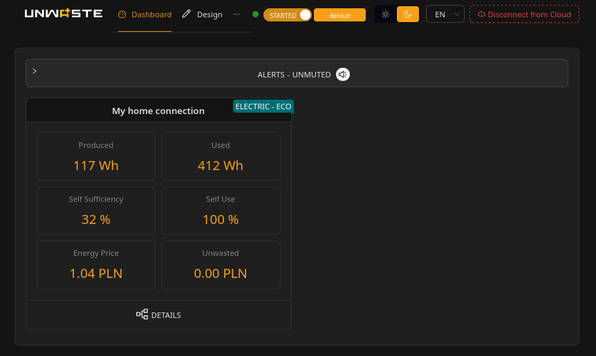
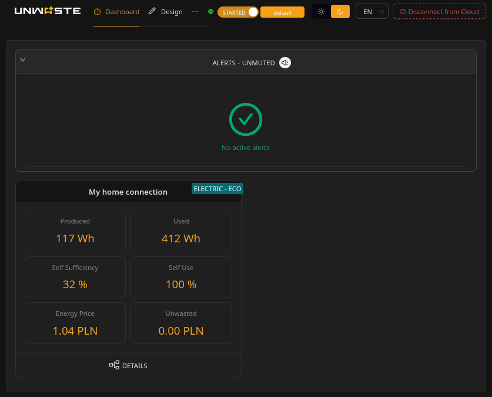
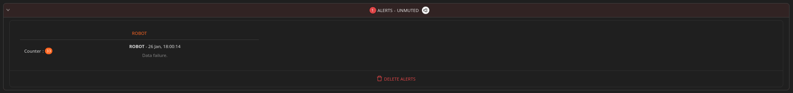

# Dashboard

### What the Dashboard is

The Dashboard provides a daily summary of system performance.

Each **connection** is presented as a separate block because connections may differ in:

* tariffs and pricing currency,
* consumption model and forecasting,
* production and storage setup.

For this reason, some metrics (especially percentages) are not safely "summable" across connections.

***

### Dashboard metrics

All Dashboard metrics show **today's totals** (midnight to now), but only for periods when the system was **STARTED**.

**Note: STARTED vs STOPPED**

If the Unwaste Robot was **STOPPED** for part of today, the Dashboard totals include only the time when it was **STARTED**. Time spent STOPPED is not recorded and cannot be reconstructed later.

See [**Unwaste Robot Operation → Starting and stopping the Unwaste Robot**](system-operation.md#starting-and-stopping-the-unwaste-robot).

Per connection, the Dashboard shows:

* **Produced (Wh, kWh)** — Total electrical energy produced locally (for example, by a PV inverter) since midnight.
*   **Used (Wh, kWh)** — Shows the **total energy consumed** since midnight **by all devices in the installation**.

    This value represents the sum of energy used by all loads, **regardless of the energy source**. It includes energy drawn from the power grid, produced by solar panels, or supplied from an energy storage
* **Self Sufficiency (%)** — How much of the consumed energy was covered by local production (directly or indirectly). This uses standard industry definitions. For precise computation, see _Inner workings → Self-use calculation_.
* **Self Use (%)** — How much of produced energy was used locally instead of being exported. This uses standard industry definitions. For precise computation, see _Inner workings → Self-use calculation_.
* **Energy Price (currency)** — The **current tariff price** for the connection. The displayed currency symbol is taken from connection configuration. **Important:** The system does not perform currency conversion. Having tariffs in different currencies is not supported.
* **Unwasted (currency)** — Total monetary value of savings attributed to the Unwaste Robot. See _Inner workings → Savings calculation_.

### Alerts

The Dashboard includes an **Alerts panel** for abnormal situations that the user should be informed about.

***

### Monitoring alerts

Separate from system **Alerts**, the Dashboard also shows **Monitoring Alerts** — user-configured threshold conditions on readings (for example low voltage or high temperature).

Monitoring alerts are defined in configuration. See [Monitoring alerts](../unwaste-robot-configuration/optional-monitoring/monitoring-alerts.md).

In Design mode, all defined monitoring alerts for a connection can be reviewed from the connection tile (**MONITORING ALERTS**).

***

#### What alerts are

Alerts represent operational issues such as:

* failure to read from a device (missing sensor data),
* failure to set an operating mode on a controlled device,
* data failure (impossible or abnormal readings),
* internet connection failures,
* failures when reading **dynamic tariffs** (important because pricing directly affects cost optimisation).

Alerts are meant to be actionable: they indicate that a part of the system may not be working correctly, or that optimisation decisions may be less accurate.

***

#### Aggregation and muting

To avoid repeated spam-like notifications:

* Alerts are **aggregated**:
  * repeated occurrences of the same alert type are grouped,
  * the system reports the situation without producing a large number of identical messages.
* Alerts can be **muted**:
  * a muted alert does not generate a notification,
  * it can still remain visible in the list for review.

**Note:** A future mobile application may deliver alerts as **push notifications**.

***

### Details button

The **DETAILS** button opens the detailed views for the selected connection (starting with **Energy Usage**).
