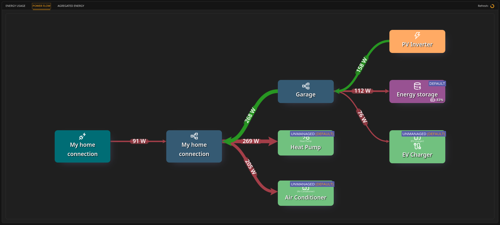

# Power Flow view

### What the Power Flow view shows

The **Power Flow** view shows the most recent _power_ readings (W) between elements.

It answers: "What is happening right now?"

**Note: availability**

Power Flow is an operational view. It is available when the Unwaste Robot is **STARTED**. When the system is **STOPPED**, operational screens are unavailable and no new readings are collected.

See **System operation → Starting and stopping the Unwaste Robot**.

***

### Key characteristics

* Values represent the **most recent reading**.
* Updated every **5 seconds**.
* No accumulation is performed.
* Power flow history is **not stored** for long-term replay in this view.

This is intentionally different from Energy Usage, which is historical and cumulative.

***

### Colors and direction

Power Flow uses the same visual rules as Energy Usage:

* Arrows represent **net direction** of current flow at the moment of reading.
* **Red** typically indicates consumption flow direction.
* **Green** typically indicates production flow direction (e.g., PV feeding circuits).

**Note:** Although in theory power is the "rate of change" of energy, the system does not present a view that allows users to compare this precisely, because graphs are stored only in aggregated form.
