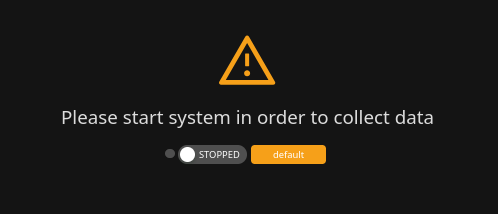

# System Operation

## Starting and stopping the Unwaste Robot

### What system state means

The Unwaste Robot has two mutually exclusive states:

* **STOPPED** (configuration mode)
* **STARTED** (operational mode)

The system state affects three areas:

* **Availability of features** (what parts of the UI can be used)
* **Data collection** (whether readings are recorded at all)
* **Device control** (whether the Unwaste Robot sends Eco / Comfort / Boost / Off signals)

A typical workflow is:

1. Stop the system to adjust configuration.
2. Start the system to collect data and apply control.
3. Keep the system started during normal operation so that history and savings calculations remain complete.

***

### STOPPED state (configuration mode)

When the system is **STOPPED**:

* The Unwaste Robot does **not collect any data**.
* The Unwaste Robot does **not control any devices**.
* No new history is created, and operational statistics do not change.
* Operational screens are unavailable, because they depend on consistent readings.

Only configuration screens are accessible in this state. This prevents partial or inconsistent states where:

* some readings are still being collected,
* while meters, circuits, devices, or tariffs are being changed.

**Important: data loss**

* Any time spent in STOPPED mode is **not recorded**.
* This missing time cannot be reconstructed later.
* If you stop the system during the day, daily totals will only reflect the periods when it was started.

(Shown when trying to access operational views while STOPPED.)

***

### STARTED state (operational mode)

When the system is **STARTED**:

* The Unwaste Robot collects readings every **5 seconds**.
* Readings are aggregated into **15-minute blocks** aligned to full quarters:
  * 10:00 → 10:15 → 10:30 → 10:45 → 11:00, etc.
* Aggregated data is stored in the database (historical tracking).
* Every 15 minutes there is a control decision moment, where the Unwaste Robot decides which signals should apply for the next 15-minute block.

**What happens if the system is stopped and started again**

* Values shown for "today" do not reset.
* They continue from the last recorded totals.
* The gap while STOPPED is simply missing from the data.

Example:

* 4 kWh were recorded between midnight and 10:00.
* The system was STOPPED from 10:00 to 15:00.
* After starting at 15:00, the "Used" value still shows 4 kWh and then continues increasing from that point onward.
